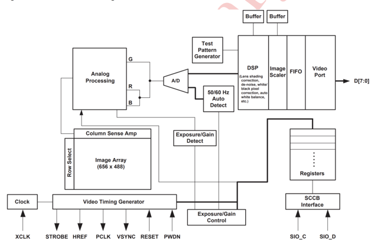
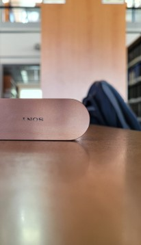

# Devices

## OV7670 Camera

OV7670 image sensor is a single chip which has a VGA camera and image
processor. To communicate with the camera a proprietary interface
\"Serial Camera Control Bus\" must be used. SCCB is similar to I2C with
the exception of the device not sending ACK bit. This distinction can
cause issues as discussed in Section 
[Communicating with the Camera](#communicating-with-the-camera). Image
processing functions such as white balance, saturation and image format
are programmable through SCCB. The camera supports RGB (565/555/444) and
YCbCr (4:2:2) image formats according to its [datasheet](http://web.mit.edu/6.111/www/f2016/tools/OV7670_2006.pdf).

## STM32F407

STM32F407 was used as the main microcontroller as it has DCMI (Digital
Camera Interface) module in it. DCMI is a synchronous parallel data bus
and works together with DMA (more on [DCMI](https://www.st.com/resource/en/application_note/an5020-digital-camera-interface-dcmi-on-stm32-mcus-stmicroelectronics.pdf)). The synchronizing signals
of Camera such as PCLK, the horizontal and vertical reference signals
are feed into DCMI. An allocated memory is filled with the incoming
image data which is directed from DCMI to DMA.

I used MBED OS 5 as STM32F407 is only supported at
version 5 and not in 6.

Here is the pinout I used:

# Architecture

Figure below depicts the architecture consisting of two
buffers and three threads that collects the data from the camera. In the next subchapters, each thread
will be studied and discussed under its own heading.

## Capture Thread

The capture thread writes the raw data from the camera to the buffer
named frame buffer. It uses mutex to prevent the processor thread from
changing the frame buffer at the same time while writing.

To simulate a DCMI module, memset is used at rows of image with varying
luminance values. This thread should work when all of the frame buffer
is consumed by processor thread. This thread fills the frame buffer at
once to the full capacity.

## Processor Thread

The processor thread maps the raw pixels in the frame buffer to a lower
resolution. Then, it does the task of
writing the current pixel values to the processed buffer. The lowest
resolution image that can be captured with the camera model OV7670 is
176x144 and contains 25344 pixels. Pixels in the raw image were divided
into groups of 16 (4x4) and this value was reduced to a single pixel by
averaging the values of 16 pixels. Therefore, the number of pixels has
been reduced from 25344 to 1584. The reduction amount in this thread can be rearranged.

Semaphore was used to manage the processed buffer between Processor
Thread and Sender Thread. In MBED terms, processor thread releases the
semaphore and the sender thread acquires it. The size of semaphore is
the downscaled image size 1584.

After every averaging operation the frameBufferIndex and sendByteIndex
is incremented. The frameBufferIndex is used to read from frameBuffer
and sendByterIndex is used to write to the second buffer which is
processedBuffer.

## Send Thread

The send thread transmits the ready-to-send pixel data in the processed
buffer via Wi-Fi using the ESP 8266 module. During this transmitting
action, the mutex is activated to prevent the processor thread from
modifying the data in the processed buffer. sendByteIndex is decremented
after sending the packet.

# Implementation Details

To have an image processing pipeline starting from camera, passing
through a microcontroller, its network interface device and ending at a
network server every step of it has to be tested to make the integration
healthy. The ideal pipeline can be summarised in steps as below:

1.  Communicating with the Camera

2.  Getting Image Bytes in Memory via DCMI

3.  Processing Image Bytes with a Processor Thread

4.  Sending the Processed Bytes with a Sender Thread

5.  Receiving Bytes at a server

6.  Reception and reconstruction of the image

To realise the bionic eye project the requirement to get lowest
resolution greyscale image possible and downscale it further. These
translated to the project to have a QCIF image of 176x144 pixels and
downscale it by 4 from both width and height.

## Communicating with the Camera

As a first test of getting image from the camera an Arduino UNO was
used. Because the Arduino code was written using registers specific to
it, it could not be transfered to MBED OS easily. However, it was useful
to see the camera working and making sure the sensor was not faulty.

Despite not using the code for the Arduino, it helped us to correct the
focal length of the camera by tuning its lens and making sure it
functioned correctly.

It is worth noting again that SCCB is very similar to I2C but it does
not have an Acknowledgement bit, ACK. It is not possible to use
functions of I2C waiting for ACK bit which might be the case for MBED.
In these scenarios it was advised to use software implementation of I2C
or a lower level hardware I2C which the developer has more control on.

Below you can see two figures one from OV7670 and the other a photo from a smartphone camera.

## Getting Data from the Camera using DCMI

STM32 CubeMX programme was used to set pins and parameters of the
microcontroller. DCMI was set as shown on Figure
below. Timing
diagrams and other work on OV7670 was used to check their values. It is
worth noting that the settings for OV2640 was different than these which
caused adapting a work on OV2640 harder than I thought. This
work was used as base for the HAL implementation as it was simple and
easy to understand. Its SCCB functions were able to write data to the
camera unlike many I2C attempts.

As the register values of OV2640 and OV7670 were diferent, the values in
the previously mentioned work had to be replaced. Some values are known
from the datasheet but some are not. A good source of default register
values is the Linux [kernel](https://github.com/torvalds/linux/blob/master/drivers/media/i2c/ov7670.c) . The register values from
the Kernel are used instead of the library's values.

DMA was set to be from peripheral to memory with an increment option on
memory. Additionally the Master Clock Output was used to generate a
clock frequency close to 40MHz which was used at XCLK, the external
clock input of OV7670.

At the end of integrating parameters and code from numerous sources and
trying to implement the desired values from the documentation, we
obtained data from DCMI, as shown below. However, I
still did not know how to convert it to a visible image.

## Porting STM HAL Implementation of DCMI to MBED OS

The HAL implementation of DCMI, DMA, GPIO and I2C was ported to MBED OS.
The system_clock file was updated to have the clock configuration of
STM32. However, SCCB was not working as fast as it was on HAL and many
write failures were rising. The clock signals were also not as clean as
HAL in MBED. Despite MBED uses HAL beneath abstraction I could not
figure out why were the differences occuring.

I believe it is possible to solve these issues with a deeper knowledge
of MBED OS and could not find helpful knowledge on the internet so we
moved on to complete the system from the server side.

## Sending Image Bytes

The socket example was done on Nucleo Boards with MBED OS 6 so I tested
it in version 5 and then with STM32F407. Figuring out a continuous
stream of data transmission via socket was tricky so I implemented an
always connect first then send approach. If an error would rise, error
handler will disconnect and reconnect back to revive the socket. This
caused many disconnections at the server side almost at every data
transmission.

## Viewing Image Bytes on PC

I decided to make the PC server and the microcontroller as client in
socket connection. The server is written in Python. The received packets
are appended and after a threshold the aggregated data is assumed to be
an image. The data is read with OpenCV and displayed with Matplotlib.

# Conclusion

Within the scope of this study, I worked on a system that downscales
the raw images taken from the camera and transmits it via Wi-Fi. In the
process I learned about interfacing with a device, getting large rates
of data, managing it in embedded systems, interfacing with an external
WiFi peripheral and sending data with sockets. I also learned about
multithread operations, protecting a buffer, writing seemingly
concurrent programmes and using processor resources more efficiently.
